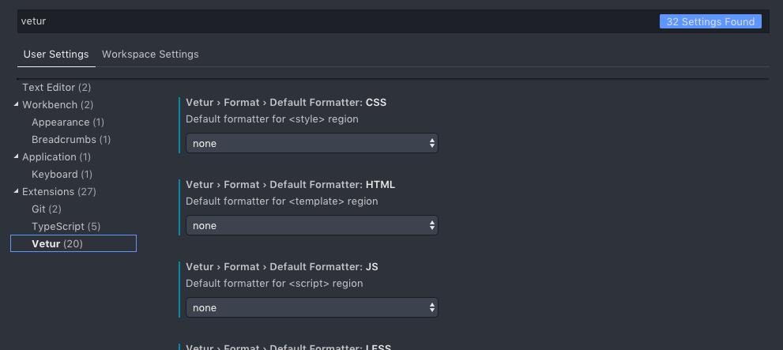

還在討論程式碼要怎麼排版？開始使用 Prettier 吧！

這篇分享 VS Code 及 Vue 的設定心得。

## TL;DR

目前在設定上會遇到的問題是 VS Code 會優先使用 Vetur 對 `.vue` 檔進行排版，所以要到 Vetur 的設定裡將排版功能[關閉](#關閉-vetur-format-功能)！

---

## 新增 Vue 專案

先使用 Vue Cli 建立新專案並體驗看看 Prettier，使用建立專案時 linter 方案選擇 **ESLint + Prettier**

## 安裝 Prettier

安裝方式官方建議使用「在專案裡安裝一個特定版本的 Prettier」的方式，原因是因為不同版本可能會有排版方式的差異，所以建議一個專案統一使用同個 Prettier 版本以統一大家的排版結果。

Global 的 Prettier 也可以安裝，用於一些未安裝 Prettier 的練習專案！

```bash
# 在專案裡安裝一個特定版本的 Prettier
yarn add prettier --dev --exact
npm install --save-dev --save-exact prettier

# or globally
yarn global add prettier
npm install --global prettier
```

安裝完成後可以用 cli 的方式排版程式碼

```bash
./node_modules/prettier/bin-prettier.js --write src/App.vue

prettier --write src/App.vue
```

## 安裝並設定 VS Code Prettier plugin

安裝：https://marketplace.visualstudio.com/items?itemName=esbenp.prettier-vscode

設定的部分先將 `prettier.disableLanguages` 中的 vue 移除

```diff
-"prettier.disableLanguages": [
-  "vue"
-]
+"prettier.disableLanguages": []
```

<br>

Prettier plugin 格式設定的部分依照喜好設定。

> **NOTE:** 由於有 `.prettierrc` 設定檔時會優先使用該檔案設定

## 新增 .prettierrc

> options 文件：https://prettier.io/docs/en/options.html

透過 `.prettierrc` 設定 Prettier。設定選項不多，選項幾乎都在下面的 example 裡面了！新增一個叫 `.prettierrc` 或 `.prettierrc.yaml` 檔案放在專案根目錄，並將以下內容貼上。

```yaml
# .prettierrc or .prettierrc.yaml

# printWidth: 80
tabWidth: 2
semi: false
singleQuote: true
# trailingComma: 'es5'
# bracketSpacing: true
arrowParens: 'avoid'
```

## 關閉 Vetur format 功能

`.vue` 檔案目前優先以 Vetur 進行 format，因此需要把 Vetur 的 foramt 功能都關掉。



## 在 VS Code 觸發 Prettier

1. `cmd` + `shift` + `p` -> Format Document
2. VS Code **format on save** 功能
3. 在 package.json 加入 script，以 format 全部檔案

```json
"scripts": {
  "format": "prettier --write 'src/**/*.{js,vue}'"
},
```
